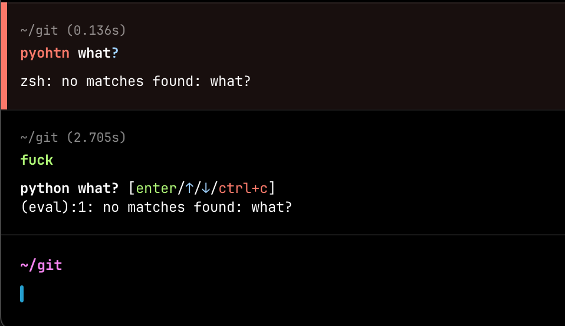

# Test Document

This document is an example for testing various Markdown features.

## Inline Math

Example equation: $y = m x + b$

## Block Math

due to auto formatting of markdown files,

use raw-typst comments

<!--raw-typst
$ sum_(k=0)^n k
    &= 1 + ... + n \
    &= (n(n+1)) / 2 $
-->

## Lists

- First item
- Second item
- Third item

1. Ordered list item
2. Second item
3. Third item

## Block Quotes

> This is a single-line quote.
>
> This is a second-line quote.

## Code Blocks

```go
package main

import "fmt"

func main() {
    fmt.Println("Hello, world!")
}
```

## Images

Let's insert a cat image here.


## Links

Here is a link to [Google](https://www.google.com).

## Table

Below is a simple table example:

<!--typst-table
caption: "This is an example of a table caption"
placement: none
columns: (6em, auto, auto)
align: (center, center, right)
label: "tab:mytable"
-->

| No. | Name   | Description  |
| --- | ------ | ------------ |
| 1   | Apple  | Red fruit    |
| 2   | Banana | Yellow fruit |
| 3   | Kiwi   | Green fruit  |

## Raw Typst Tags

<!--raw-typst
#box[This sentence is written directly in Typst syntax!]
-->

## Exclusion of Certain Sections

This section will be converted.

<!--typst-begin-exclude-->

This section is enclosed between `<!--typst-begin-exclude-->` and
`<!--typst-end-exclude-->`, so it will not appear in the Typst conversion.

<!--typst-end-exclude-->

Additionally, the content after this exclusion will be converted.

By running the conversion program with this example document, you can verify the following features:

1. **Heading level conversion**
2. **Inline/block math processing**: Check if equations are properly converted to Typst format.
3. **List conversion (ordered and unordered)**
4. **Block quote handling** (Optional: Verify if it converts to Typst's `#blockquote`)
5. **Code blocks**
6. **Image insertion** (Check if alt text correctly appears as captions)
7. **Link conversion**
8. **Table conversion** (Ensure correct alignment of cells)
9. **Raw Typst tags** (Preserve Typst syntax inside HTML comments)
